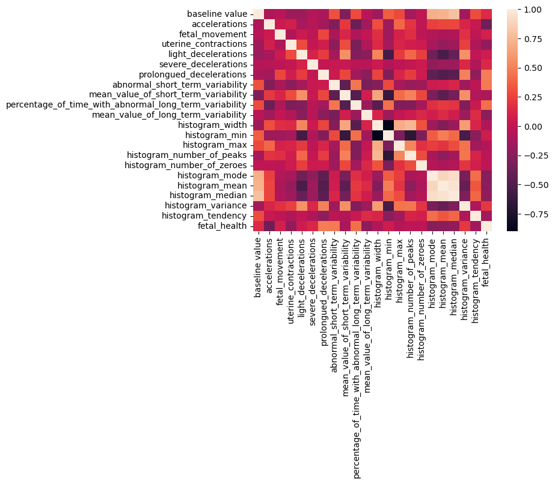
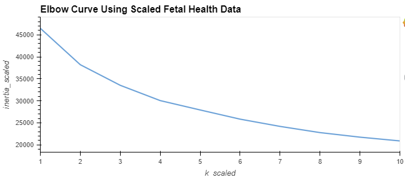
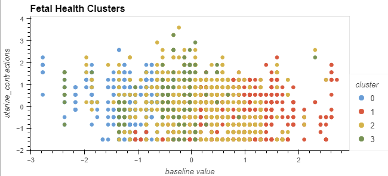
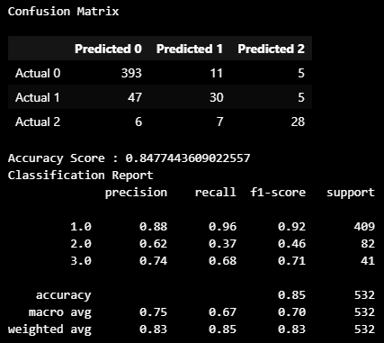

# Fetal_Health

## Overview

Improving Fetal Health with Machine Learning: Analyzing Cardiotocogram (CTG) Data. This project tackles the crucial challenge of reducing preventable child mortality.

Cardiotocograms (CTGs) are a cost-effective and widely available tool for fetal health assessment. CTGs monitor fetal heart rate (FHR), fetal movement, uterine contractions, and other vital signs, empowering healthcare professionals to make informed decisions and potentially prevent child and maternal mortality.

Data Exploration:
This dataset offers 2126 records containing features extracted from CTG exams. These features were meticulously classified into three categories by a panel of three expert obstetricians: Normal, Suspect, Pathological.

## Exploratory Data Analysis

What's in the data?

    RangeIndex: 2126 entries, 0 to 2125
    Data columns (total 22 columns):
    #   Column                                                  Non-Null Count  Dtype  
    ---  ------                                                  --------------  -----  
    0   baseline value                                          2126 non-null   float64
    1   accelerations                                           2126 non-null   float64
    2   fetal_movement                                          2126 non-null   float64
    3   uterine_contractions                                    2126 non-null   float64
    4   light_decelerations                                     2126 non-null   float64
    5   severe_decelerations                                    2126 non-null   float64
    6   prolongued_decelerations                                2126 non-null   float64
    7   abnormal_short_term_variability                         2126 non-null   float64
    8   mean_value_of_short_term_variability                    2126 non-null   float64
    9   percentage_of_time_with_abnormal_long_term_variability  2126 non-null   float64
    10  mean_value_of_long_term_variability                     2126 non-null   float64
    11  histogram_width                                         2126 non-null   float64
    12  histogram_min                                           2126 non-null   float64
    13  histogram_max                                           2126 non-null   float64
    14  histogram_number_of_peaks                               2126 non-null   float64
    15  histogram_number_of_zeroes                              2126 non-null   float64
    16  histogram_mode                                          2126 non-null   float64
    17  histogram_mean                                          2126 non-null   float64
    18  histogram_median                                        2126 non-null   float64
    19  histogram_variance                                      2126 non-null   float64
    20  histogram_tendency                                      2126 non-null   float64
    21  fetal_health                                            2126 non-null   float64
    dtypes: float64(22)
    memory usage: 365.5 KB

## Unsupervised Learning

Imports

    from sklearn.cluster import KMeans
    from sklearn.decomposition import PCA
    from sklearn.preprocessing import StandardScaler

### Using clustering find the best value for k using scaled data

    # Create a list with the number of k-values from 1 to 11
    k_scaled = list(range(1, 11))

    # Create an empty list to store the inertia values
    inertia_scaled = []

    for i in k_scaled:
    model = KMeans(n_clusters=i, random_state=0)
    model.fit(un_sup_df_scaled_new)
    inertia_scaled.append(model.inertia_)

 

**k = 4 seems to be the best fit for this model**

### Cluster fetal health with K-means using the scaled Data

    # Initialize the K-Means model using the best value for k
    model = KMeans(n_clusters=4)

    # Fit the K-Means model using the scaled data
    model.fit(un_sup_df_scaled_new)

    # Predict the clusters to group the fetal health using the scaled data
    clusters_k4 = model.predict(un_sup_df_scaled_new)

    new_df.hvplot.scatter(
        x = "baseline value", y = "uterine_contractions", by = "cluster", hover_cols = ["fetal_health"], title = "Fetal Health Clusters") 

 

### Optimize Clusters with Principal Component Analysis.

    # Create a PCA model instance and set `n_components=3`.
    pca = PCA(n_components=3)

    # Use the PCA model with `fit_transform` to reduce to three principal components.
    un_pca_data = pca.fit_transform(un_sup_df_scaled)

### Retrieve the explained variance to determine how much information can be attributed to each principal component.

    pca.explained_variance_ratio_

    Output: array([0.27553613, 0.16673811, 0.10405716])

### Since the variance is so low, around 59%, other machine learning tools should be used.

## Supervised Learning

Imports

    # Import the modules
    import numpy as np
    import pandas as pd
    from pathlib import Path
    from sklearn.metrics import confusion_matrix, accuracy_score, classification_report
    # Import the train_test_learn module
    from sklearn.model_selection import train_test_split
    # Import the LogisticRegression module from SKLearn
    from sklearn.linear_model import LogisticRegression

Create the labels set (y)  from the “fetal_health” column, and then create the features (X) DataFrame from the remaining columns.

    # Separate the y variable, the labels
    y = df["fetal_health"]

    # Separate the X variable, the features
    X = df.drop(columns="fetal_health")

### Fetal Health is defined by Normal = 1.0, Suspect = 2.0, Pathological = 3.0

Split the data into training and testing datasets by using `train_test_split`.

    # Split the data using train_test_split
    # Assign a random_state of 1 to the function
    X_train, X_test, y_train, y_test = train_test_split(X, y, random_state=1)

### Logistic Model

    # LogisticRegression module 

    # Instantiate the Logistic Regression model
    # Assign a random_state parameter of 1 to the model
    classifier = LogisticRegression(random_state=1)

    # Fit the model using training data
    log_model = classifier.fit(X_train, y_train)

    # Make a prediction using the testing data
    predictions = log_model.predict(X_test)

### Evaluate the model’s performance by doing the following:

Generate a confusion matrix for the model

Calculating the accuracy score

Print the classification report.  

    # Generate Confusion Matrix
    cm = confusion_matrix(y_test, predictions)
    cm_df = pd.DataFrame(
        cm, 
        index=["Actual 0", "Actual 1", "Actual 2"], 
        columns=["Predicted 0", "Predicted 1", "Predicted 2"]
         )

    #Generate Accuracy Score
    acc_score = accuracy_score(y_test, predictions)

    # Displaying results
    print("Confusion Matrix")
    display(cm_df)
    print(f"Accuracy Score : {acc_score}")
    print("Classification Report")
    print(classification_report(y_test, predictions))

 

## Deep Learning and Optimizations

### Resources
https://www.kaggle.com/datasets/andrewmvd/fetal-health-classification/data

https://onlinelibrary.wiley.com/doi/10.1002/1520-6661(200009/10)9:5%3C311::AID-MFM12%3E3.0.CO;2-9

https://www.ncbi.nlm.nih.gov/pmc/articles/PMC10000592/#:~:text=To%20date%2C%20cardiotocography%20(CTG),a%20challenging%20signal%20processing%20task.

low variance - https://stats.stackexchange.com/questions/584174/interpretation-of-low-variance-in-pca
