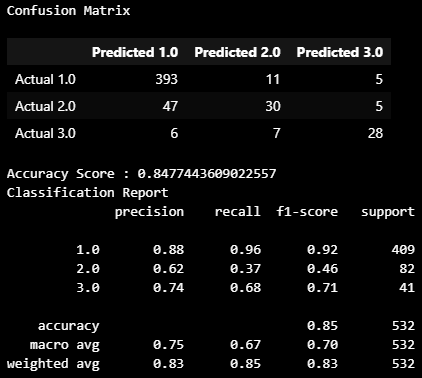

# Fetal_Health

## Overview

Improving Fetal Health with Machine Learning: Analyzing Cardiotocogram (CTG) Data. This project tackles the crucial challenge of reducing preventable child mortality.

Cardiotocograms (CTGs) are a cost-effective and widely available tool for fetal health assessment. CTGs monitor fetal heart rate (FHR), fetal movement, uterine contractions, and other vital signs, empowering healthcare professionals to make informed decisions and potentially prevent child and maternal mortality.

Data Exploration:
This dataset offers 2126 records containing features extracted from CTG exams. These features were meticulously classified into three categories by a panel of three expert obstetricians: Normal, Suspect, Pathological.

## Exploratory Data Analysis

What's in the data?

    RangeIndex: 2126 entries, 0 to 2125
    Data columns (total 22 columns):
    #   Column                                                  Non-Null Count  Dtype  
    ---  ------                                                  --------------  -----  
    0   baseline value                                          2126 non-null   float64
    1   accelerations                                           2126 non-null   float64
    2   fetal_movement                                          2126 non-null   float64
    3   uterine_contractions                                    2126 non-null   float64
    4   light_decelerations                                     2126 non-null   float64
    5   severe_decelerations                                    2126 non-null   float64
    6   prolongued_decelerations                                2126 non-null   float64
    7   abnormal_short_term_variability                         2126 non-null   float64
    8   mean_value_of_short_term_variability                    2126 non-null   float64
    9   percentage_of_time_with_abnormal_long_term_variability  2126 non-null   float64
    10  mean_value_of_long_term_variability                     2126 non-null   float64
    11  histogram_width                                         2126 non-null   float64
    12  histogram_min                                           2126 non-null   float64
    13  histogram_max                                           2126 non-null   float64
    14  histogram_number_of_peaks                               2126 non-null   float64
    15  histogram_number_of_zeroes                              2126 non-null   float64
    16  histogram_mode                                          2126 non-null   float64
    17  histogram_mean                                          2126 non-null   float64
    18  histogram_median                                        2126 non-null   float64
    19  histogram_variance                                      2126 non-null   float64
    20  histogram_tendency                                      2126 non-null   float64
    21  fetal_health                                            2126 non-null   float64
    dtypes: float64(22)
    memory usage: 365.5 KB

## Unsupervised Learning

Imports

    from sklearn.cluster import KMeans
    from sklearn.decomposition import PCA
    from sklearn.preprocessing import StandardScaler

### Using clustering find the best value for k using scaled data

    # Create a list with the number of k-values from 1 to 11
    k_scaled = list(range(1, 11))

    # Create an empty list to store the inertia values
    inertia_scaled = []

    for i in k_scaled:
    model = KMeans(n_clusters=i, random_state=0)
    model.fit(un_sup_df_scaled_new)
    inertia_scaled.append(model.inertia_)

 

**k = 4 seems to be the best fit for this model**

### Cluster fetal health with K-means using the scaled Data

    # Initialize the K-Means model using the best value for k
    model = KMeans(n_clusters=4)

    # Fit the K-Means model using the scaled data
    model.fit(un_sup_df_scaled_new)

    # Predict the clusters to group the fetal health using the scaled data
    clusters_k4 = model.predict(un_sup_df_scaled_new)

    new_df.hvplot.scatter(
        x = "baseline value", y = "uterine_contractions", by = "cluster", hover_cols = ["fetal_health"], title = "Fetal Health Clusters") 

 

### Optimize Clusters with Principal Component Analysis.

    # Create a PCA model instance and set `n_components=3`.
    pca = PCA(n_components=3)

    # Use the PCA model with `fit_transform` to reduce to three principal components.
    un_pca_data = pca.fit_transform(un_sup_df_scaled)

### Retrieve the explained variance to determine how much information can be attributed to each principal component.

    pca.explained_variance_ratio_

    Output: array([0.27553613, 0.16673811, 0.10405716])
**Since the variance is so low, around 59%, other machine learning tools should be used.**

## Supervised Learning

Imports

    # Import the modules
    import numpy as np
    import pandas as pd
    from pathlib import Path
    from sklearn.metrics import confusion_matrix, accuracy_score, classification_report
    # Import the train_test_learn module
    from sklearn.model_selection import train_test_split
    # Import the LogisticRegression module from SKLearn
    from sklearn.linear_model import LogisticRegression

Create the labels set (y)  from the “fetal_health” column, and then create the features (X) DataFrame from the remaining columns.

    # Separate the y variable, the labels
    y = df["fetal_health"]

    # Separate the X variable, the features
    X = df.drop(columns="fetal_health")

### Fetal Health is defined by Normal = 1.0, Suspect = 2.0, Pathological = 3.0

Split the data into training and testing datasets by using `train_test_split`.

    # Split the data using train_test_split
    # Assign a random_state of 1 to the function
    X_train, X_test, y_train, y_test = train_test_split(X, y, random_state=1)

### Logistic Model

    # LogisticRegression module 

    # Instantiate the Logistic Regression model
    # Assign a random_state parameter of 1 to the model
    classifier = LogisticRegression(random_state=1)

    # Fit the model using training data
    log_model = classifier.fit(X_train, y_train)

    # Make a prediction using the testing data
    predictions = log_model.predict(X_test)

### Evaluate the model’s performance by doing the following:

Generate a confusion matrix for the model

Calculating the accuracy score

Print the classification report.  

    # Generate Confusion Matrix
    cm = confusion_matrix(y_test, predictions)
    cm_df = pd.DataFrame(
        cm, 
        index=["Actual 0", "Actual 1", "Actual 2"], 
        columns=["Predicted 0", "Predicted 1", "Predicted 2"]
         )

    #Generate Accuracy Score
    acc_score = accuracy_score(y_test, predictions)

    # Displaying results
    print("Confusion Matrix")
    display(cm_df)
    print(f"Accuracy Score : {acc_score}")
    print("Classification Report")
    print(classification_report(y_test, predictions))

 

It is shown that in the confusion matrix the normal (1.0) and pathological (3.0) data is highly predictive, while in the suspect (2.0) fails to be predictive. The accuracy score is 85% and is a good estimate of the preformance of this model, the confusion matrix shows that only the normal and pathological samples should have a higher confidence of accuracy, not the suspect samples. Meanwhile, the classification report shows in greater detail the percentages of precision, recall, and f1-scores can be most trusted in the normal samples at 96%, while the pathological samples are the next to be trusted at 71%. On the other hand, the suspect samples are should to not be trusted with the f1-score being below 50%.

## Deep Learning and Optimizations

### Using Tensorflow and Keras, find the best hyperparameters 

Imports

    from sklearn.model_selection import train_test_split
    from sklearn.preprocessing import StandardScaler
    from sklearn.cluster import KMeans
    import kerastuner as kt
    import tensorflow as tf
    from tensorflow.keras.models import Sequential

Split our preprocessed data into our features and target arrays

    y = fetal_health_df['fetal_health']
    X = fetal_health_df.drop(['fetal_health'], axis = 1)

    # Create a StandardScaler instances
    scaler = StandardScaler()

    # Fit the StandardScaler
    X_scaler = scaler.fit(X_train)

    # Scale the data
    X_train_scaled = X_scaler.transform(X_train)
    X_test_scaled = X_scaler.transform(X_test)

Create a method that creates a new Sequential model with hyperparameter options

    def create_model(hp):
        nn_model = tf.keras.models.Sequential()

        # Allow kerastuner to decide which activation function to  use in hidden layers
        activation = hp.Choice('activation',['relu','tanh','sigmoid'])

        # Allow kerastuner to decide number of neurons in first layer
        nn_model.add(tf.keras.layers.Dense(units=hp.Int('first_units',
            min_value=1,
            max_value=10,
            step=2), activation=activation, input_dim=21))

        # Allow kerastuner to decide number of hidden layers and neurons in hidden layers
        for i in range(hp.Int('num_layers', 1, 6)):
            nn_model.add(tf.keras.layers.Dense(units=hp.Int('units_' + str(i),
                min_value=1,
                max_value=10,
                step=2),
                activation=activation))

        nn_model.add(tf.keras.layers.Dense(units=1, activation="sigmoid"))

        # Compile the model
        nn_model.compile(loss="categorical_crossentropy", optimizer='adam', metrics=["accuracy"])

        return nn_model

Import the kerastuner library

    tuner = kt.Hyperband(
        create_model,
        objective="val_accuracy",
        max_epochs=20,
        hyperband_iterations=2)

Run the kerastuner search for best hyperparameters 

    tuner.search(X_train_scaled, y_train, epochs=20, validation_data=(X_test_scaled, y_test))

    Output:
    Trial 60 Complete [00h 00m 12s]
    val_accuracy: 0.7781955003738403

    Best val_accuracy So Far: 0.7781955003738403
    Total elapsed time: 00h 05m 36s

Top hyperparameters

    {'activation': 'sigmoid',
    'first_units': 3,
    'num_layers': 3,
    'units_0': 5,
    'tuner/epochs': 3,
    'tuner/initial_epoch': 0,
    'tuner/bracket': 2,
    'tuner/round': 0,
    'units_1': 1,
    'units_2': 1}

### Set up Neural Network for Deep Learning

**Model Architecture**:

Input Layer: Number of Input Features (21)

Hidden Layer 1: 3 nodes, Activation Function: sigmoid

Hidden Layer 2: 5 nodes, Activation Function: sigmoid

Output Layer: 1 node, Activation Function: sigmoid

Number of epochs: 3

    # Define the model - deep neural net, i.e., the number of input features and hidden nodes for each layer.
    number_input_features = len(X_train_scaled[0])
    hidden_nodes_layer1 =  5
    hidden_nodes_layer2 = 1

    nn = tf.keras.models.Sequential()

    # First hidden layer
    nn.add(tf.keras.layers.Dense(units=hidden_nodes_layer1, input_dim=number_input_features, activation="sigmoid"))

    # Second hidden layer
    nn.add(tf.keras.layers.Dense(units=hidden_nodes_layer2, activation="sigmoid"))

    # Output layer
    nn.add(tf.keras.layers.Dense(units=1, activation="sigmoid"))

    # Check the structure of the model
    nn.summary()

Model Description

    Model: "sequential"
    _________________________________________________________________
    Layer (type)                Output Shape              Param #   
    =================================================================
    dense (Dense)               (None, 5)                 110       
                                                                    
    dense_1 (Dense)             (None, 1)                 6         
                                                                    
    dense_2 (Dense)             (None, 1)                 2         
                                                                    
    =================================================================
    Total params: 118 (472.00 Byte)
    Trainable params: 118 (472.00 Byte)
    Non-trainable params: 0 (0.00 Byte)
_________________________________________________________________

Compile the model 

    nn.compile(loss="categorical_crossentropy", optimizer="adam", metrics=["accuracy"])

Train the model

    fit_model = nn.fit(X_train_scaled, y_train, epochs=3)

Evaluate the model using the test data

    model_loss, model_accuracy = nn.evaluate(X_test_scaled,y_test,verbose=2)
    print(f"Loss: {model_loss}, Accuracy: {model_accuracy}")

    Output:

    17/17 - 0s - loss: 0.0000e+00 - accuracy: 0.7744 - 310ms/epoch - 18ms/step
    Loss: 0.0, Accuracy: 0.7744361162185669

**The top model in Keras hypertuner has an accuracy of 77.44%**

## Summary of Findings

Upon the initial exploratory data analysis, the data is highly skewed. Of the entire dataset consisting of 2113 records, 77.85% is of normal fetal health, 13.88% of suspect fetal health, and 8.28% of pathological fetal health. That notwithstanding, further machine learning analysis was done to find the best predictive models. 

Unsupervised learning was implemented first. K-means was applied to find the clustering patterns. Upon further inspection, the clustering was not enough to gain important information. Next, principal component analysis was applied to the dataset and quickly the finding was shown to only include variance ratio of 59%. This figure was too low to proceed further.

Next, supervised machine learning was used to investigate the dataset to learn if predictive models could be used to help determine fetal health. Using logistic regression, the data was trained and a confusion matrix, accuracy score, and classification report was generated. As previously mentioned in the analysis above, the skewed data makes it is hard to have a highly predictive model. The normal samples generated a highly predictive model, but this may be because there was a significant more data-points. Next, the pathological samples had the next highest predictive model, but it was still below 75%, so not incredibly resilient. And lastly, the suspect samples failed in this model, with an f1-score below 50%. 

Finally, deep learning was implemented to find if this model could generate a predictive model. First, using TensonFlow and Keras, the generation of the best hyperparameters was implemented. Next the the top model was used. The result was a neural network that generated an accuracy of 77.44%. While this is not the greatest outcome, it seems the most promising for classification for all fetal health states. 

Further work should include gathering more data on the suspect and pathological fetal health states. Until this data is generally more even in its variance, this models will struggle to accurately generate predictions that could improve health professionals' decisions in determining the fetal health during a woman's pregnancy.

### Resources
https://www.kaggle.com/datasets/andrewmvd/fetal-health-classification/data

https://onlinelibrary.wiley.com/doi/10.1002/1520-6661(200009/10)9:5%3C311::AID-MFM12%3E3.0.CO;2-9

https://www.ncbi.nlm.nih.gov/pmc/articles/PMC10000592/#:~:text=To%20date%2C%20cardiotocography%20(CTG),a%20challenging%20signal%20processing%20task.

low variance - https://stats.stackexchange.com/questions/584174/interpretation-of-low-variance-in-pca
